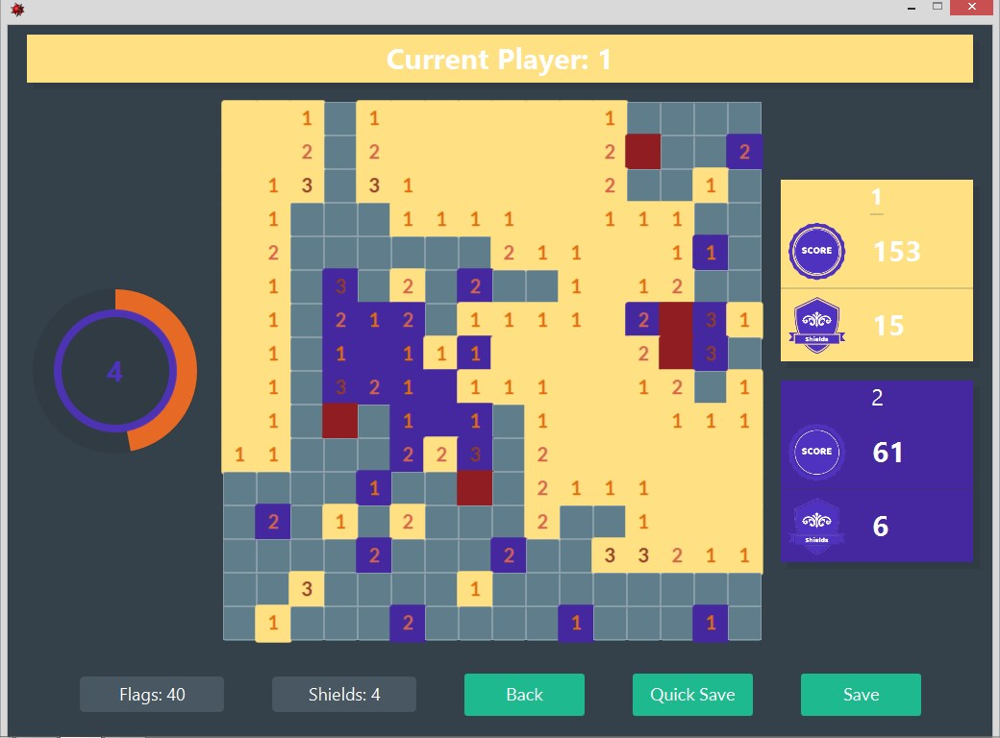
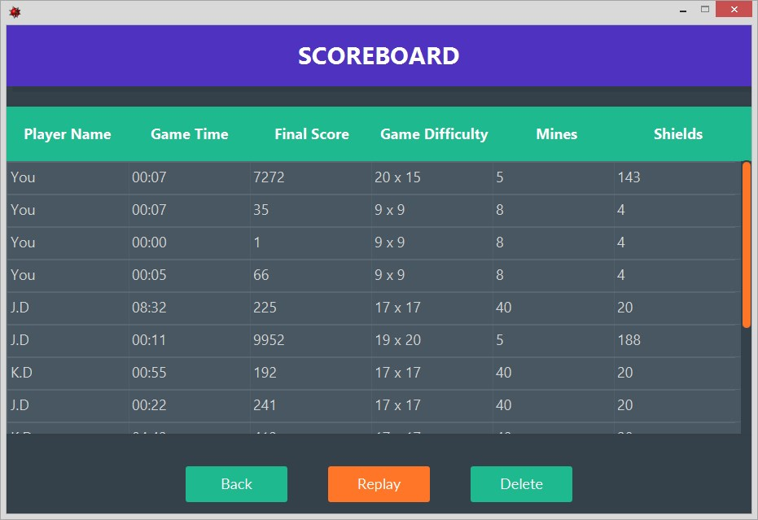
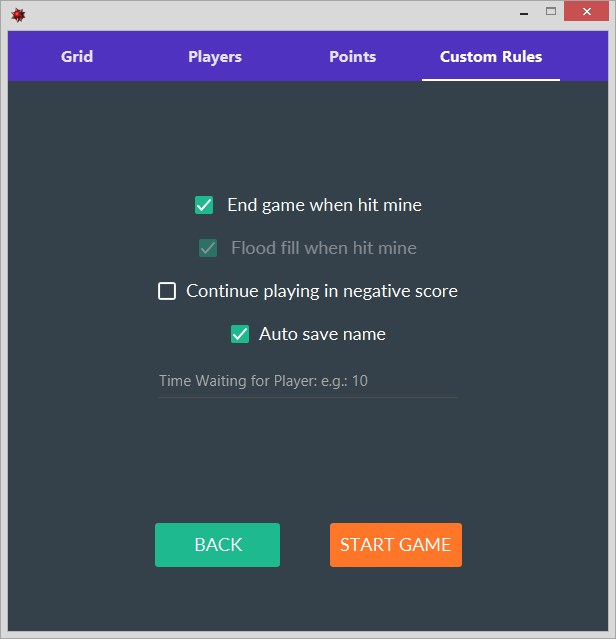

# MineSweeper Material Desgin
> Built With Java, 
> Used IntelliJ IDE
> and JavaFX for the gui 

A new Material-Designed Minesweeper Game that contains alot of new features such as Shields, Multiplayer, New rules and more

## Developed By:
* [Kareem Dabbeet](https://github.com/KareemDa)
* [Mouaz AlKhoudari](https://github.com/mhz1990)
* [Omar Alshallah](https://github.com/Omar-Sh1)

All of us studnig ITE at Damascus Univercity
# Download:
### Game: [download game from here](https://goo.gl/NKL8Dz)
* Full Project: just clone or download the full repo

---

## ScreenShots:
 
 

## Features:

Explore alot of new features that you've never see in a minesweper gameBefore:

1. **Points:** so you have a score when you play a new game , your score will be increase when you open an empty cell,numbe cell and will decreases "Or mayble you'll lose" When you hit a mine!

2. **Shields:** Think MineSweeper is hard game that you can never win? We added Shields! no lose from the first to moves now
   Shields are hidden in the grid and when you open a square that conatin one of thems , your shields will increase by one
   And When you hit a mine it will decreased by one
   
3. **Multyplayer:** So because whe added score to the game, it will be more enjoyable if you played it with your friend, or even with      pc.
   We Added two new types of game: VS Dump PC, or Multyplayer game vs your friends(in 1 pc)
   
4. **Custom Options:** You can change the game options as you want: Change grid size,difficulty of game, game rules, point rules & more

5. **Save & Load:** you can save your games to continue it any time you want

6. **Score Board & Replay Games**: all the games you've finished will be saved to watch it when you want, also the result will be added to scoreboard

---
## Installation:
Just downoad the game,Extract ZIP File and double click the jar file 
see README for troubleshooting if the game didnt start correctly:

## Coming Soon:

1. theme changing
2. choose custom color for each player
3. Profile to add your name, Avatar image

## Release History

* 1.0.0
   * Game Released

## External Libraries Used:
* [JFoenix](https://github.com/jfoenixadmin/JFoenix)
   
